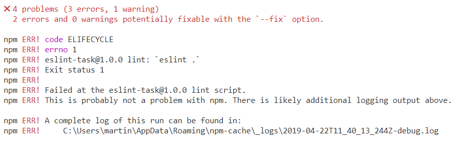

# ESLint - In home activity

1. Setup and try ESLint

   - Place the `.eslintrc.json` file from the Template folder into one of your local folders in which you will write some code
   - Install the [ESLint](https://marketplace.visualstudio.com/items?itemName=dbaeumer.vscode-eslint) VSCode extension 
   - Install the needed packages

     ```
     npm install eslint eslint-config-google -D
     ```

     Think what the above is doing? How many packages it installs and in which dependencies they end up?
   - Or use the provided `package.json` file and run `npm install`
   - Write some fun JavaScript code or use this one

     ```js
     var text = 'Telerik Academy';
     console.log(unexistingVariable);
     ```

   - If the setup is correct, VSCode ESlint extension should underline the rule violations
     <br/>
     
   - The extension also provides you with autofix option for some of them
     <br/>
     

2. Add scripts to automate the process of error finding and fixing

   ```json
   // package.json
   "scripts": {
     "lint": "eslint .",
     "lint-fix": ""
   },
   ```

   - research what the lint-fix script should be
   - run `npm run lint` and try `npm run lint-fix`
   - Notice that fix option won't fix everything, but it could automate a lot of code fixes

3. If you receive an `!ERR` output when running the lint script, like the example below, try adding the `--silent` flag when executing the command

   - `npm run lint --silent`

     

4. Research for the [ESLint supported rules](https://eslint.org/docs/rules/) and test some of them in the suggested **rules property** in the **.eslintrc.json** file

   - A comma at the end of the file or after last property is forbidden because it will be invalid and ESLint won't work

   ```json
   "rules": {
     "quotes": 2 // no comma here
   },
   "parserOptions": {
     "ecmaVersion": 12,
     "sourceType": "module" // no comma here
   } // no comma here
   ```
